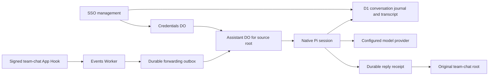

# Cloud Agent architecture

Cloud Agent runs a Pi conversation in Cloudflare Durable Objects for each eligible team-chat root. Signed Channel Talk App Hooks enter the companion Events Worker. The Agent generates a reply and sends it to the original root. The runtime does not require a ChatGPT scheduled task.

## Source identity and durable delivery

The Events Worker verifies the hook signature and checks the configured channel, group and app boundary before forwarding. Root identity maps deterministically to an Assistant DO. A comment reuses its root's account and conversation; a new root creates an independent conversation. D1 stores the native Pi journal and the indexed session, entry and source-message history. Durable Objects coordinate running work, preserve account pins and retain pending delivery recovery.

The forwarding outbox retains work across failed calls and restarts. The Agent records processing and delivery receipts. Duplicate deliveries, concurrent events and interrupted operations are exercised in workerd checks. These receipts bound replay within the service; an external API's response loss cannot be turned into a universal exactly-once guarantee.

The D1 adapter uses Pi's native `MemoryStorage` commit validation. It persists the validated write batch atomically before applying it in memory. The same Storage object is used by the Pi harness and its submission/session helpers. A reconnect replays the committed journal rather than regenerating model output. An ambiguous append requires a confirmed matching journal record or a storage reopen.

Existing native SQL tables are frozen recovery backups. Import compares observable native storage results before switching new writes to D1, preserving IDs, sequences, documents and fork cutoffs. Import resumes in bounded batches. The first version bounds journal size instead of silently truncating it. See [conversation storage](CONVERSATION_STORAGE.md) for limits and the runnable conformance check.

## Accounts and administration

Credentials DOs wrap OAuth credentials and verified identity metadata with AES-GCM. Existing installations must preserve their wrapping key, additional-data value and storage identities. Provider metadata remains absent when the verified identity token does not supply it.

The management page authenticates pinned administrators through OIDC with PKCE, signed identity verification and CSRF checks. The workspace separates a searchable conversation list and readable messages from global settings. Recognizable Manager names are resolved for observed senders through the existing App, with tenant/channel-scoped caching and explicit ID fallbacks. Administrators manage accounts, model choices, thinking levels, sessions and skills. Staff commands expose help, model and thinking controls. Account selection can pin new roots to one account or use an explicit round-robin pool. Existing roots keep their account pin.

Account labels use the verified provider account ID, with the service's stable registration ID as a fallback. Usage totals count model tokens committed by this service. They do not measure the account's global subscription allowance.

## Skills and operation snapshots

Administrators publish validated text skills and resources as immutable revisions. Enabled skills form a content-hashed manifest. A started operation captures its account, session, model, thinking level and manifest version. Retries and recovery reload that snapshot rather than silently adopting changed settings. A later operation can capture a newer enabled manifest.

Pi exposes `activate_skill` and `read_skill_resource` for these approved resources. Publication alone does not supply a filesystem, shell, GitHub access or business-system tools. The bundled pstack adapter preserves upstream text and licensing within this restricted runtime. Its package and publication checks are reproducible; installation into a hosted catalog is a separate operation.

## Verification

Run the commands in [the app README](../README.md) to build both Workers and exercise actual workerd with generated credentials and mocked outbound services. Native checks cover source filtering, durable forwarding, ordering, duplicate events, OAuth refresh, SSO and CSRF, account pinning, administrator controls, skills and token accounting. The independent control suite covers concurrent mutations and restart persistence.

These checks do not prove the behavior of a real provider login or a particular live installation. `typecheck` currently checks JavaScript syntax. Native coverage attempts the workerd Profiler API and fails explicitly when it is unavailable; no coverage percentage is inferred from the Node harness.

## Public implementation and private configuration

The public repository retains the runtime, tests, architecture, fixtures and reproducible verification. Private installation configuration supplies domains, resource IDs, administrator identities, source boundaries and branding. Follow [the publication order](../../../AGENTS.md) before transferring generic work into a private deployment repository. Actual messages, credentials and hosted evidence are excluded from public commits.

Each customer uses a separate installation with an immutable tenant identity. See [customer isolation](TENANCY.md) for the namespace, credential and database boundaries.
