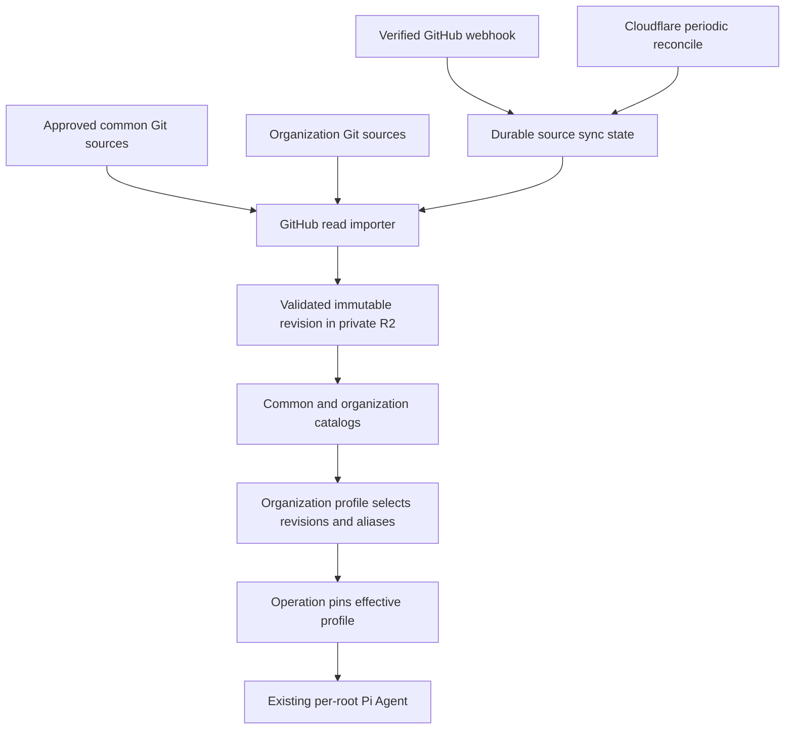

# Common and organization plugins from Git

This is a proposed extension to [the filesystem and plugin design](FILESYSTEM_AND_PLUGINS.md). Git import, organization catalogs and automatic updates are not implemented. The current runtime has a single installation's owner catalog; adding scoped plugin records does not by itself provide multi-organization request routing or SSO roles.

## Selected composition

Keep reusable instruction plugins in a common catalog and private instructions in an organization catalog. An organization profile selects exact revisions from both. GitHub repository visibility does not determine runtime scope: a public source can supply an organization-only plugin, and a private organizational source must not be promoted to the common catalog. Common publication uses approved public material and redistribution-compatible licensing. Common means reusable by authorized profiles, not anonymously downloadable content; R2 stays private.



Use host-qualified package identities such as `common/summarize` and `org/org-example/work-policy`. Keep these identities separate from the original `SKILL.md` name and the model-visible alias. Catalog lookups enforce organization membership before reading revisions or listing metadata. R2 prefixes can be `plugins/common/<id>/<digest>/` and `plugins/org/<organization-id>/<id>/<digest>/`; prefixes are not authorization.

An effective profile contains explicit common and organization revision references, validated configuration and administrator grants. A common plugin can remain on revision A in one organization while another selects revision B. New shared publication does not force every organization to update.

| Composition option | Consequence | Decision |
| --- | --- | --- |
| Merge common and organization folders with an implicit organization-wins rule | Duplicate names silently change behavior with source order; configuration and permissions become hard to inspect | Reject |
| Select qualified revisions and unique skill aliases in one profile | The administrator can inspect the exact content and granted tools before activation | Use |

The current application's manifest Map keeps the last duplicate skill name, while the SDK's multi-source resolver keeps the first. Reject duplicate effective aliases before publication rather than depending on either behavior. Existing valid skill names remain provenance; the adapter generates or validates aliases against the current skill-name constraints. To replace a common skill with an organizational variant, explicitly deselect the former and select the latter. Do not merge their instruction files implicitly.

Initially keep each original skill name as its effective alias and reject duplicates across the selected set. Supporting renamed aliases later requires a mapping from the alias to its qualified package, revision and original name. Both skill loading and resource reads must use that reverse mapping; resource paths remain relative to the original skill. Declared cross-skill dependencies must resolve to selected qualified references. Ambiguous or unresolved dependencies remain staged. Preserve original source bytes and expose any resolved runtime name mapping alongside adapted instructions; do not attempt arbitrary prose rewriting.

Keep current capacity limits during composition: 64 KiB per text file, 256 KiB per embedded skill, 20 catalog entries per installation and 1 MiB for an active skill manifest. The current entry limit is not a new per-organization allowance. Validate the complete selected profile; scoped records and R2 storage do not bypass these limits.

Organization settings can override declared non-secret defaults only through the plugin's permitted schema. File content cannot increase grants, change account selection or select credentials. Channel policy selects an organization profile and can restrict capabilities; it does not add a hidden source-order override. In the first installation, existing Super Admins manage both catalog scopes. Future organization-admin roles require authenticated SSO membership and source-channel mapping before separate organizations can use the service. Preserve existing DO identities during that migration.

## Git is the authoritative source

A repository can contain several plugins under selected paths:

```text
plugins/
  summarize/
    SKILL.md
    references/
    templates/
  work-policy/
    SKILL.md
    references/
```

This is an example layout, not a requirement to create another repository. Register the appropriate directories in existing repositories. Adapt supported upstream layouts explicitly; a plugin marketplace descriptor or script is not automatically a Pi-compatible skill. Keep the source commit, original paths, original names, license information and imported file hashes with the packaged revision.

Administrator uploads can validate and preview a package. For a Git-managed plugin, the canonical activated bundle must match an exact commit in its registered source. A local edit or upload first becomes a reviewed Git commit, then enters the same importer. Initially use GitHub editing or a generated patch for that commit. An eventual upload-to-Git button needs an explicitly configured writer path with selected-repository write permission, separate from the read-only importer. Neither R2 nor the runtime catalog becomes an independent source of plugin text. Runtime installation settings and secret references can remain in the private control catalog.

## GitHub connection

Use a GitHub App with repository Contents read-only, selected repository access and push events. Installation tokens can be narrowed to permitted repositories and expire after one hour. Public repositories can also be read without authentication. A third-party public repository can be polled if its owner has not installed the App; immediate webhooks require a repository connection the owner authorizes. See [App installation](https://docs.github.com/en/apps/using-github-apps/installing-your-own-github-app), [installation authentication](https://docs.github.com/en/apps/creating-github-apps/authenticating-with-a-github-app/authenticating-as-a-github-app-installation) and [Contents read access](https://docs.github.com/en/rest/repos/contents#get-repository-content).

Store the App private key and webhook secret in the existing secret-manager/platform bindings. Never put them in a plugin, repository or model tool result. The host registers installation ID, repository ID, tracked ref and allowed source paths for an authenticated organization. A webhook's installation ID is not itself an SSO organization identity; only an authorized administrator can establish that mapping. Use stable repository IDs across renames and revalidate repository visibility, installation ownership and access when syncing.

The installed Agents SDK can consume approved manifests and R2 skill resources. It does not currently expose a GitHub importer. Add a small host-side GitHub HTTP reader; no Git executable, local Codex, Linux container or GitHub Actions workflow is required for read-only synchronization.

## Durable automatic import

1. Verify HMAC-SHA256 on the original webhook bytes, then validate event, installation, repository and registered ref. Persist a delivery receipt and source-dirty job before returning 2XX. Do not perform the full import in the webhook request.
2. Resolve the registered ref to its current exact commit, then read that commit's tree and permitted blobs. Do not combine files fetched from a moving branch or trust the webhook's changed-file list as a complete snapshot.
3. Apply the existing text, path, script, size and manifest validators. Reject unsupported executable content, submodules and LFS pointers. Resolve only explicitly approved internal symlinks at the same commit, or reject them.
4. Upload immutable bytes, verify their digests and publish a complete staged revision. A source generation and expected-profile version check prevent an older job from replacing a newer desired revision. Partial failure retains the active profile.
5. Activate through the organization's update policy. Pin the resulting exact commit, bundle digest, aliases, settings and grants in the next operation's profile; retries of an older operation retain its original content.

[GitHub recommends a response within ten seconds](https://docs.github.com/en/webhooks/using-webhooks/best-practices-for-using-webhooks). Use a durable management-DO job and alarm for the initial serial importer; introduce a separate Queue only when measured load requires it. Deduplicate delivery IDs and imported content, while permitting retry of a failed job. Redelivery uses the original delivery ID, and [GitHub does not automatically redeliver failures](https://docs.github.com/en/webhooks/using-webhooks/handling-failed-webhook-deliveries). A receipt must therefore distinguish pending, completed and failed states.

A Cloudflare periodic trigger reconciles registered refs and accessible repositories to catch missed hooks and recover pending work. Hook order is not commit order. Ref deletion, installation suspension/removal, repository-access changes and rate limits produce visible source status; do not infer access solely from an event's repository arrays. Stop new fetches and activations when access or common-source visibility is invalid. Existing approved cached revisions follow the host's revocation policy, including the explicit emergency-revoke path. This synchronization does not require a ChatGPT scheduled monitor.

Use tree mode and blob IDs for provenance and symlink handling. Contents responses can resolve symlinks implicitly. Recursive tree responses can be truncated; fetch approved subtrees or reject incomplete enumeration. Bound bytes and file count even when GitHub accepts a larger object. See [Git tree reads](https://docs.github.com/en/rest/git/trees#get-a-tree), [Contents constraints](https://docs.github.com/en/rest/repos/contents#get-repository-content) and [webhook signature verification](https://docs.github.com/en/webhooks/using-webhooks/validating-webhook-deliveries).

## Update policy

| Policy | Automatic behavior | Activation |
| --- | --- | --- |
| Stage, the default | Fetch and validate the latest observed head of each registered source; intermediate heads may be coalesced | Administrator approval selects the exact revision |
| Trusted instruction updates, explicit opt-in | Fetch and validate changes within previously approved source/ref, paths, kind, schema and grants | Publish the complete effective profile only when all checks and generation checks pass |

Trusted updates never replace a source's separate exact-revision human approval or governance activation rules. Unchanged schema and grants do not prove that instruction prose preserves authority. Sources requiring revision approval remain staged until the required approval evidence is established; exclude them from trusted updates until that boundary is implemented.

For trusted updates, new tools, scripts, requested capability changes, configuration-schema changes, name collisions or increased grants always remain staged. Keep the active profile when an imported set loses a required skill or dependency. Recompose all references and validate the entire profile before a single pointer update. Both policies preserve rollback revisions and audit source commit, digest, importer policy and activating principal or approved automation policy. Changing an update policy remains a Super Admin action.

## Record sketch

```ts
// Design only; these records are not implemented.
type PluginScope = { kind: "common" } | { kind: "organization"; organizationId: string };
type GitPluginSource = {
  id: string;
  scope: PluginScope;
  installationId?: number; // absent only for explicitly permitted public polling
  repositoryId: number;
  ref: string;
  allowedRoots: string[];
  updateMode: "stage" | "trusted-instructions";
  policyVersion: string;
  generation: number;
};
type ScopedPluginRef = {
  packageId: string;
  digest: string;
  sourceCommit: string;
  aliases: Record<string, string>; // identity mapping initially; renaming needs source adaptation
  config: Record<string, unknown>; // this plugin's validated settings or credential references
};
type OrganizationPluginProfile = {
  organizationId: string;
  version: string;
  plugins: ScopedPluginRef[];
  grants: string[];
};
// syncSource(hostSourceId, expectedGeneration)
// composeProfile(adminPrincipal, organizationId, selectedRefs, expectedVersion)
```

Reuse the existing management DO's catalog, serialization and audit; isolate source/delivery job records from account secrets. Put the GitHub reader and sync validation in `workers/pi/plugin-sync.js` when implemented. Keep profile composition in the proposed `plugins.js` and retain operation snapshot capture in `index.js`. No new tenant service is needed to experiment with common and organization scope in the current single installation.

## Required checks

1. Common and organization references resolve independently of enumeration order; duplicate aliases fail activation and another organization cannot list or read private metadata or files.
2. Wrong signatures, unregistered installations/repos/refs and source paths fail. A failed delivery can retry; completed duplicates do not republish.
3. Interrupted or truncated imports retain the active version. Old jobs cannot roll back the desired source; source access changes suspend further publication.
4. Restarted operations retain their original revision, settings and grants after sync. Trusted text updates cannot install scripts or escalate capabilities.
5. UI uploads without matching registered Git provenance stay staged, and rollback remains an explicit profile selection.

Generic importer, scoped catalog, configuration UI and checks belong in the public product repository. Actual repository selections, organization mapping, private plugin text and hosting configuration belong in the private deployment repository, adopted after the public change is published.
