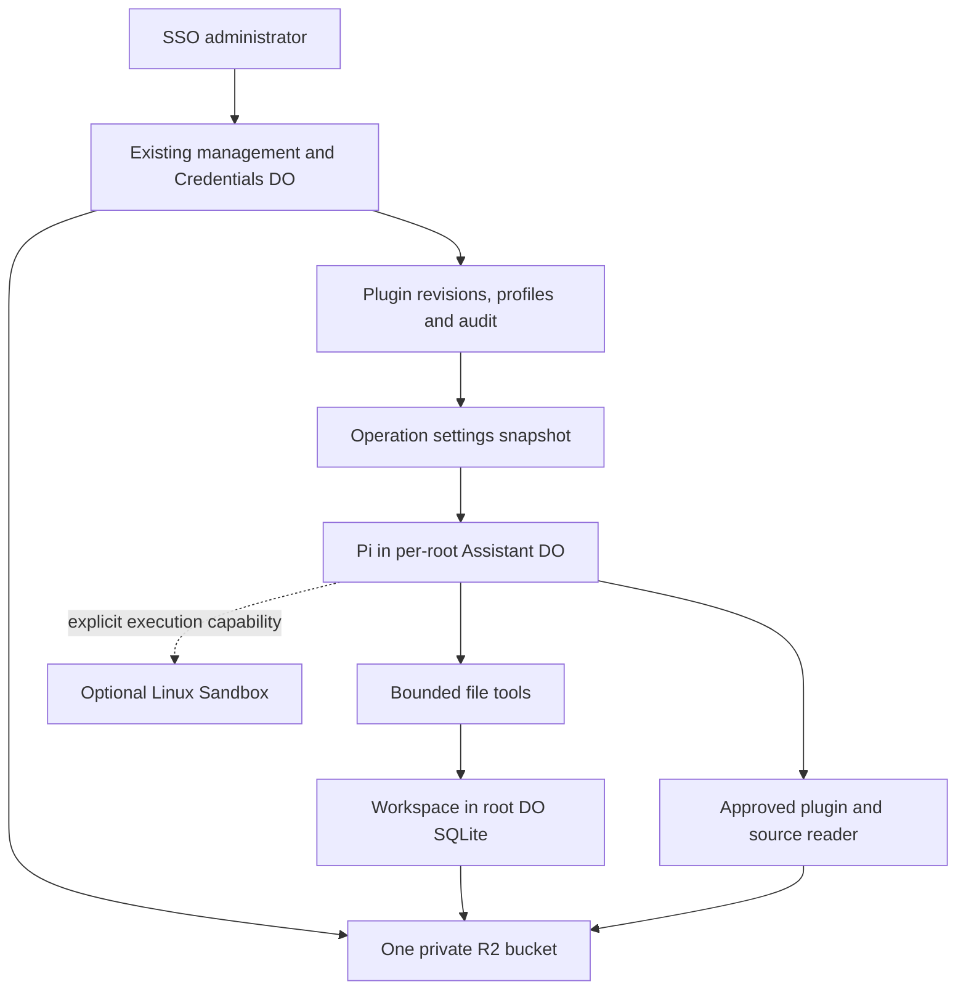

# Agent filesystem and administrator plugins

This design extends the existing Pi Agent with durable file tools and administrator-managed plugins. It is a proposed architecture, not an implemented filesystem, uploader or R2 binding. Conversation, account, SSO and delivery behavior stay in their existing Durable Objects.

## Intended use

An agent can read approved operating instructions, fill a template, save working notes and produce a file for its own team-chat root. A Super Admin uploads a plugin, inspects its contents and requested permissions, supplies settings and selects where it is enabled. Staff continue to use the existing help, model and thinking commands.

The planned public implementation covers reusable storage adapters, plugin validation, management UI, tests and generated examples. Private repositories contain installation configuration and private operating materials. Follow [the publication rules](../../../AGENTS.md).

## Selected architecture



Reuse a Cloudflare Workspace implementation for file metadata, directories and bounded text storage. R2 spillover is a later capability with a recovery gate. The current [experimental shell Workspace](https://github.com/cloudflare/agents/blob/main/packages/shell/README.md) provides these operations; pin and test the selected SDK version before implementation. Its codemode providers are not directly interchangeable with Pi tool registrations. Start with a small explicit Pi adapter rather than exposing an entire execution provider.

The existing management DO owns approved revisions, enabled profiles and audit. Each Assistant DO owns its root's working files. R2 holds immutable plugin/source objects and, after the write-recovery checks pass, larger workspace objects. No separate registry DO is required in the first release.

An R2-only filesystem would require directory, editing, search and concurrency behavior to be rebuilt. A Sandbox-first design supplies Linux commands, but introduces container lifetime and disk recovery before that workload is required. Choose Workspace plus R2 now and attach a Sandbox when an approved plugin needs actual Bash, Python or package execution.

## File layout and scope

The model sees these logical paths:

```text
/workspace/                         read and write for this root
  notes/
  files/
  output/
/plugins/<plugin-id>/<revision>/    approved plugin files, read only
/sources/<source-id>/<revision>/    approved repository documents, read only
```

The host derives workspace identity from installation and source-root identity. Neither a model argument nor a plugin can select another root, tenant, bucket or storage prefix. The Workspace SQL namespace is stable and separate from Pi's tables. Its R2 prefix includes the host-derived workspace ID.

Sessions in the same root share its Workspace by default. Changing the model, starting a new Pi session or cloning a transcript does not delete or copy files. A transcript fork is not a filesystem fork. Independent file branches require an explicit administrator checkpoint-and-copy action in a later phase. Different roots always have different workspaces.

R2 uses separate application prefixes:

```text
plugins/<plugin-id>/<content-digest>/...
sources/<source-id>/<commit-sha>/...
workspaces/<workspace-id>/...       Versioned large files, after recovery checks
artifacts/<workspace-id>/<operation-id>/...
```

These prefixes do not provide authorization by themselves. The host enforces ownership before using the R2 binding. Keep bucket public access disabled. Do not expose raw bucket-key tools, S3 credentials or a generic public file route.

Start with `list_files`, `read_file`, `write_file` and `search_files`. The first release writes bounded text files inline in SQLite and does not pass an R2 binding to Workspace. Reads are bounded and paginated. A successful write must replace a complete file and record its tool receipt atomically from the caller's perspective. Add a bounded edit tool only with expected-content hashes and recovery checks. Do not add symlink creation or recursive deletion to the first tool set. Normalize paths and validate resolved paths against their permitted mount, including traversal and symlink escapes.

Root operations already run through a durable queue. File mutations use that queue and host-issued tool-call receipts. Replaying a tool call returns its committed result instead of overwriting newer file content. The file adapter must commit inline content and its receipt in one SQLite transaction or provide a durable journal with equivalent recovery checks. Ordinary Workspace calls alone do not establish this contract.

The inspected experimental Workspace overwrites a stable R2 path key before updating SQL, and its SQL-error cleanup can delete that key. It also deletes the old R2 object before an R2-to-inline conversion commits. Do not enable that write path for durable agent files. For large-file writes, use an immutable object per write: upload and verify bytes, then commit its SQL pointer and receipt. Keep the previous object until the commit succeeds. An interrupted upload may leave an unreferenced object; it must not remove the committed file. Gate spillover on native overwrite, restart and injected SQL-failure checks against the pinned SDK and adapter.

## Plugin classes and permissions

| Class | Contents | Execution |
| --- | --- | --- |
| Instruction | `SKILL.md`, references, templates and non-secret defaults | Existing skill activation and bounded resource reads |
| Tool configuration | Settings for a host-registered integration and its requested capabilities | Host-approved tool bindings only |
| Sandbox script | Reviewed script files and declared execution requirements | Optional Sandbox executor only |

The first release supports instruction plugins and the file tools. The other classes are explicit extension points and are rejected until their host capability is implemented. An uploaded JavaScript module is never automatically imported or evaluated inside the management or Agent Worker. Plugin files and descriptions cannot grant permissions.

Split requested capabilities from administrator grants. A deployment profile can grant workspace reads/writes and named host tools. Store sensitive configuration as credential references resolved by the host, not plaintext plugin settings. A model never receives authentication tokens or raw administrator configuration.

Package one plugin as a manifest plus selected files. Accept a ZIP or selected folder through the management page, and adapt recognized upstream layouts into this format. Resolve approved internal source links while publishing or reject them; never permit an archive to write outside its staging namespace. Bound compressed size, expanded bytes and file count, and reject absolute paths, duplicate normalized paths, special files and escaping links.

Keep existing skill constraints when adapting packages: 64 KiB per text file, 256 KiB per embedded skill, 20 catalog entries and 1 MiB for the existing active skill manifest. R2 references must be validated and read on demand; placing them in R2 must not bypass the text or script policy. Report capacity errors before activation. Set any new archive/workspace quotas explicitly in installation policy rather than treating R2 capacity as an unlimited tool budget.

## Revision, profile and operation records

Use separate records for uploaded revisions and activation. One approved revision can appear in several profiles; a revision does not have a single global enabled boolean.

```ts
// Design sketch only. These types and methods are not implemented.
type PluginRevision = {
  id: string;
  digest: string;
  kind: "instruction" | "tool-config" | "sandbox-script";
  status: "staged" | "validated" | "approved" | "rejected";
  source?: { repository: string; commit: string };
  files: Array<{ path: string; sha256: string; bytes: number; mediaType: string }>;
  requestedCapabilities: string[];
};

type PluginProfile = {
  version: string;
  plugins: Array<{ id: string; digest: string; config: Record<string, unknown> }>;
  grantedCapabilities: string[];
};

type FileOperationContext = {
  workspaceId: string;
  pluginProfileVersion: string;
  operationId: string;
};

// The host supplies context; the model supplies only the bounded file request.
// readFile(context, { path, offset, maxBytes })
// writeFile(context, { path, content, expectedHash? })
// publishPlugin(adminPrincipal, { uploadId, approvedDigest })
// configureProfile(adminPrincipal, { expectedVersion, pluginRefs, settings, grants })
```

Configuration is validated against the plugin's permitted schema; arbitrary settings never become endpoint URLs, credentials or dynamic code. Profile publication uses an expected-version check to prevent two administrators from overwriting each other's changes. Repository commit provenance and per-file hashes accompany the content digest.

Capture the plugin profile version alongside the existing operation's account, session, model, thinking and skill manifest version. A new operation can capture a new profile. Recovery uses the original profile, configuration and resource digests. Existing stored operations without this field use an empty plugin profile; preserve their original skill hashes and replay behavior.

Normal disabling affects future operations. An emergency revoke is a separate host policy checked before each plugin tool call and can abort a running session. It prevents further access but cannot undo external effects or make the model forget text it already read.

## Administrator workflow

1. Upload or import a selected repository commit into a staged revision.
2. Inspect validation results, source revision, files and requested permissions.
3. Approve the content digest and supply non-secret settings or credential references.
4. Publish an enabled profile for the selected channel policy, then run its protected test.
5. Inspect the test result and audit; select a prior profile for rollback or revoke the plugin.

Reuse the current SSO, Super Admin, CSRF and audit path. Profile targets come from host-approved channel policies; an upload cannot introduce a new tenant or channel. Show plugin name, source/version, enabled scope, granted capabilities, configuration status and latest test result. Staff do not receive plugin upload, activation, credential or execution settings through slash commands.

Only verified, complete R2 revisions can be activated. If validation, upload or verification fails, retain the existing active profile. Plugin upload does not activate schedules, business-system writes or another channel's trust policy. Refer to [repository content storage](REPOSITORY_CONTENT.md) for commit selection and immutable source publication.

For common and organization catalogs, Git ownership and automatic synchronization, read [common and organization plugins from Git](COMMON_ORG_GIT_PLUGINS.md). That extension uses explicit revision selection and unique skill aliases.

## Minimal module changes

```text
workers/pi/index.js       Existing Pi lifecycle, queue and operation snapshots
workers/pi/admin.js       Existing SSO management, plugin catalog and profiles
workers/pi/workspace.js   Workspace mount policy and bounded Pi file tools
workers/pi/plugins.js     Bundle validation, revision reads and skill adaptation
tests/workers/            Native storage, recovery, authorization and model-tool checks
```

The two new modules own filesystem rules and plugin rules. Do not add a generic extension framework, a new credential store or a new conversation service. Sandbox execution becomes a separate module only when needed.

## Implementation units and acceptance checks

1. Add bounded SQLite Workspace file tools and immutable R2 resource reads. Prove isolation across two roots, restart persistence, read-only mounts, atomic write receipts and denial of path escapes. Open large-file writes only after the versioned-object adapter passes overwrite and SQL-failure recovery checks.
2. Add staged plugin uploads and profiles. Prove incomplete uploads, hash mismatch, unsupported scripts and stale profile updates cannot activate content.
3. Connect plugins and files to Pi. Prove an actual tool sequence can activate a skill, read its template, write an output and read it after restart; denied tools remain unavailable.
4. Pin recovery and administrator controls. Prove duplicate file calls do not overwrite newer content, older operations retain their plugin revision, normal disable applies to new operations and emergency revoke stops subsequent calls.
5. Add Sandbox execution only for a selected script workload. Prove checkpoint recovery and explicit network/tool restrictions; do not automatically replay an execution whose external effects are unknown.

Workspace supplies the basic file operations. The application must add and verify its receipt, authorization, immutable resource and plugin-profile adapters for the first four units. A Linux [Sandbox](https://developers.cloudflare.com/sandbox/files/) can supply real command execution later; container disk requires explicit persistence and is not automatically durable because its controller is a DO.
